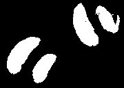

# helloworld

This module is a minimal example of a [dpkit](https://github.com/dpkit/) module.

## Overview

A typical WSI usually contains a significant amount of whitespace around the tissue being analyzed.
This module generates a binary mask to help locate that tissue.
Because this is a minimal example, the technique used here is crude and the quality of the segmentation quality is low.
But since it takes only a few lines of code and executes quickly on CPU, it is a useful example to start with.

The algorithm here creates an image where each native tile of the TIFF file corresponds to a pixel.
Each pixel uses the compressed size of the tile as value.
Then, the image is simply binarized with the popular automatic threasholding algorithm otsu.

## Disclaimer

Because uniform color compresses well, tiles that mostly contain whitespace will be small compared to the others.
But this is also true for any other uniform area of the WSI.
Thus, this segmentation will easily miss tissue when its uniform and compresses well.

## Implementation

This module in particular produces a PNG mask with a corresponding JSON report and takes as input a WSI file.
In this case, the module expect a JSON line per requests.
Here is an example:

```json
{"id":"1", "inputs":{"wsi": "/wsi/CMU-1.svs"}, "outputs": "/out"}
```

The module is expected to produce a JSON line per response on `stdout` for each request.
Once the response is produced, generated files should already be available at the location specified in the response.
All keys starting with an `$` are understood to be references to output files (or directories) to be persisted.
Here is an example of the output of the request above:

<table>
<tr><th>CMU-1.png</th><th>stdout</th></tr>
<tr><td>


</td><td>

```json
{
  "id": "1",
  "results": {
    "$mask": "CMU-1.png",
    "coverage": {
      "size": 23220,
      "mask": 4346,
      "area": 0.1871662360034453,
      "%": "18.72",
      "present": true
    }
  }
}
```
</td></tr></table>
